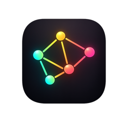

<p align="center">
  
</p>

<h1 align="center">Memois</h1>

<p align="center">
  <strong>Meeting recorder & transcriber for macOS</strong><br>
  Captures system audio + microphone, transcribes with AssemblyAI
</p>

<p align="center">
  <a href="https://github.com/arturogj92/memois/releases/latest">
    
  </a>
  
  
  <a href="LICENSE">
    
  </a>
</p>

---

## Features

- **Dual audio capture** — Records both system audio (what others say) and your microphone simultaneously using ScreenCaptureKit + AVAudioEngine
- **Global shortcut** — Start/stop recording from anywhere with a customizable keyboard shortcut (default: `⌥⇧R`)
- **Floating indicator** — Draggable recording indicator with live timer and audio level visualization
- **AssemblyAI transcription** — Batch transcription with Universal-3 Pro or Nano models
- **Speaker diarization** — Identifies who said what in the transcript
- **Crash-safe recording** — Audio saved in 1-minute chunks so you never lose more than the last minute
- **Usage tracking** — Monitor transcription usage, cost estimates, and free tier remaining
- **Search** — Find recordings by date, duration, status, or transcript content

## Install

1. Download the latest `.zip` from [Releases](https://github.com/arturogj92/memois/releases/latest)
2. Unzip and drag **Memois.app** to `/Applications`
3. Open the app and grant the required permissions:
   - **Microphone** — to capture your voice
   - **Screen Recording** — to capture system audio via ScreenCaptureKit
   - **Input Monitoring** — for the global keyboard shortcut

## Setup

1. Get a free API key from [AssemblyAI](https://www.assemblyai.com/) ($50 in free credits, ~185 hours)
2. Paste it in **Settings → AssemblyAI API Key**
3. Press `⌥⇧R` to start recording, press again to stop
4. Click **Transcribe** on any recording

## Build from Source

Requires Xcode 16+ and [XcodeGen](https://github.com/yonaskolb/XcodeGen).

```bash
brew install xcodegen
git clone https://github.com/arturogj92/memois.git
cd memois
xcodegen generate
open Memois.xcodeproj
```

## License

[MIT + Commons Clause](LICENSE) — Free to use, modify, and distribute. Not for resale.
